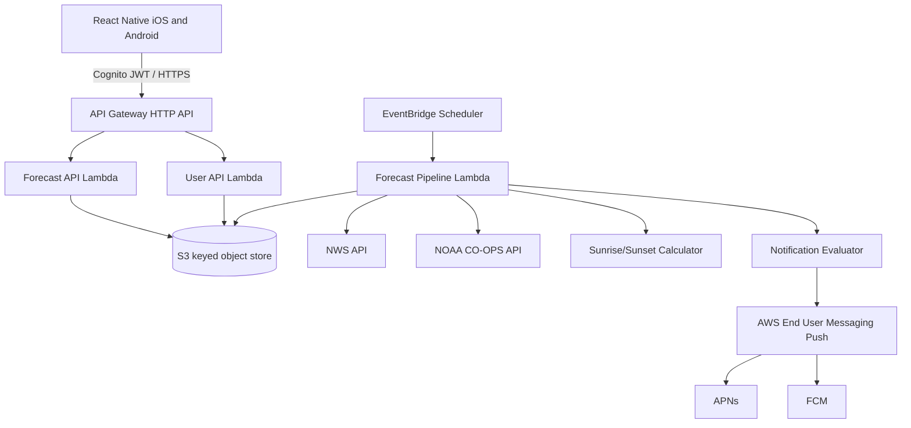

# Architecture

## Logical modules

- `weather-source`
- `tide-source`
- `solar-calculator`
- `normalizer`
- `direction-classifier`
- `window-generator`
- `suitability-scorer`
- `publisher`
- `forecast-api`
- `user-api`
- `notification-evaluator`

## Initial deployment units

For the MVP, source acquisition, normalization, scoring, and publishing may be one Lambda with clear internal module boundaries. Split only when retries, operational isolation, or independent scaling justify it.
