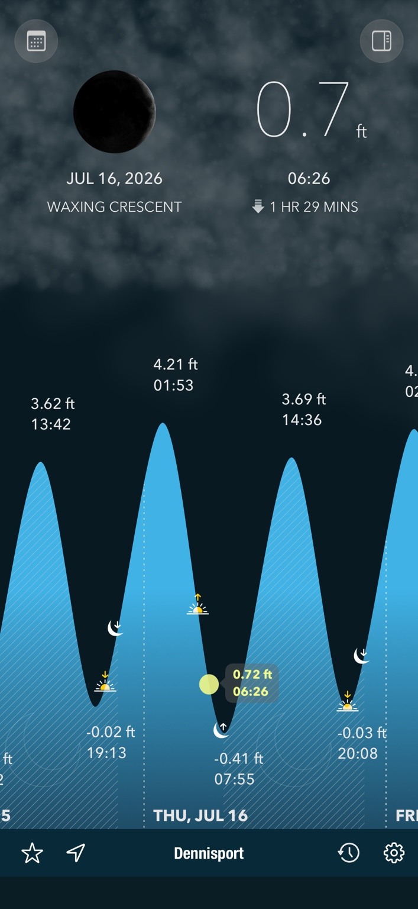
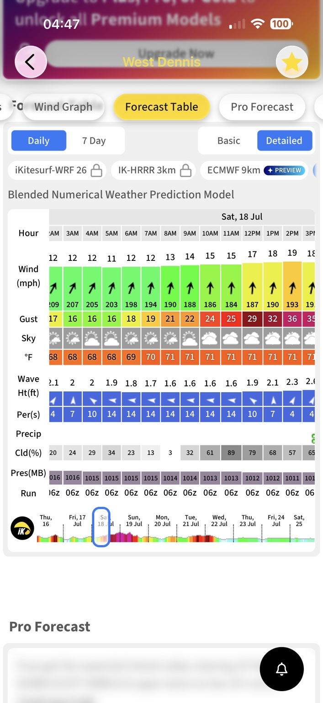
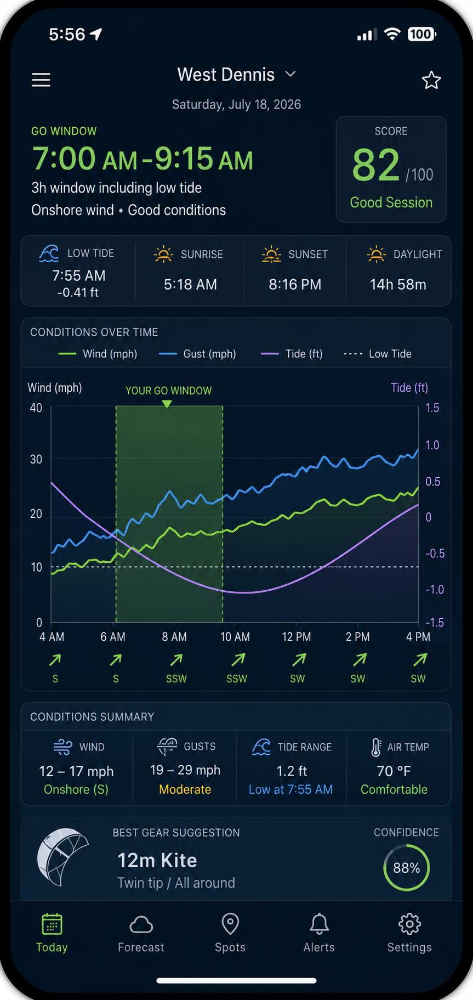

# Initial Design: Iceforge Kite Window

## 1. Purpose

Iceforge Kite Window is a mobile decision-support application for kitesurfing. It combines tide, wind, gust, direction, daylight, weather, and user safety preferences into one clear answer:

- **GO**
- **MARGINAL**
- **NO GO**

The initial location is **West Dennis Beach / Dennisport, Massachusetts**.

The user currently consults two separate applications:

1. A tide application showing the tidal curve and low-tide time.
2. iKitesurf showing hourly wind speed, gusts, direction, sky, temperature, wave height, period, precipitation, cloud cover, and model information.

The new application should remove the need to mentally combine these sources.

## 2. Original source material

### Tide source screenshot

### Wind source screenshot

### Approved iPhone concept

## 3. Chronological design history

### 3.1 Initial request

The user supplied the two screenshots and asked for an intuitive view showing when conditions are suitable for kitesurfing at Dennisport, Massachusetts.

The initial hard requirements were:

- Wind must be **onshore**.
- There must be a **three-hour session window**.
- The three-hour window must **include low tide**.

### 3.2 Initial decision view

The first proposed experience centered on a simple “Should I Go?” decision card containing:

- Overall status: GO, MARGINAL, or NO GO
- Wind speed and gusts
- Wind direction and onshore classification
- Low-tide time
- Recommended session window
- Overall suitability score
- A timeline showing when the conditions enter and leave the acceptable range

Using the supplied example data, the proposed interpretation was that the wind direction was good but wind speed was marginal during the low-tide period.

### 3.3 Expanded UX requirement

The user approved the concept and asked to add:

- Sunrise
- Sunset
- A graph showing conditions trending into and out of the acceptable range
- A screenshot-style iPhone concept before detailed technical design

The approved mockup introduced:

- A prominent GO WINDOW
- A score out of 100
- Low tide, sunrise, sunset, and total daylight summary cards
- A combined timeline for wind, gusts, and tide
- Shaded recommended window
- Wind direction arrows
- Conditions summary
- Suggested kite size
- Forecast confidence

### 3.4 Backend and platform direction

The user then set the following technical direction:

- Backend hosted in AWS
- Public weather and tide data sources
- S3 keyed lookups instead of DynamoDB
- AWS mobile services supporting both iOS and Android

The proposed platform became:

- React Native + TypeScript for iOS and Android
- AWS Amplify client libraries
- Cognito for authentication
- API Gateway HTTP API
- Lambda backend
- EventBridge Scheduler for refreshes
- S3 for configuration, raw inputs, normalized forecasts, published decisions, users, and current pointers
- AWS End User Messaging Push for APNs and FCM
- AWS CDK in TypeScript for infrastructure

### 3.5 Public data source direction

The initial source strategy is:

- **National Weather Service API** for forecast, observations, and alerts
- **NOAA CO-OPS** for tide predictions and observed water levels
- Sunrise and sunset calculated from latitude, longitude, date, and timezone

The architecture must retain provider abstraction because kitesurfing may eventually require a higher-resolution wind source than standard NWS hourly forecasts.

### 3.6 Spot configuration

Each kite location is a versioned configuration document containing:

- Latitude and longitude
- Timezone
- Shore orientation
- Accepted and prohibited wind sectors
- Weather provider mapping
- Tide station mapping
- Default decision rules

Wind direction is stored in degrees, not only labels such as S or SSW. The engine classifies the relative angle between incoming wind and the beach orientation as:

- Direct onshore
- Side-onshore
- Cross-shore
- Side-offshore
- Offshore

### 3.7 Decision-engine direction

The engine separates hard safety constraints from weighted preferences.

#### Hard constraints

A window is rejected when any configured hard rule fails, including:

- Offshore or side-offshore wind
- The three-hour window does not include low tide
- Required daylight is not available for the full window
- Wind or gust exceeds configured maximums
- Thunderstorm or marine-warning policy rejects the session
- Source data is insufficient or stale beyond policy

#### Weighted criteria

Candidate windows are scored using:

- Wind speed quality
- Wind direction quality
- Tide alignment
- Gust stability
- Weather comfort
- Forecast confidence and freshness

A proposed initial weighting was:

| Factor | Weight |
|---|---:|
| Wind speed | 30 |
| Wind direction | 25 |
| Tide alignment | 20 |
| Gust stability | 15 |
| Weather | 5 |
| Confidence | 5 |

The scoring method should weight the weakest portion of the session heavily so two excellent hours do not conceal one unsafe hour.

### 3.8 Timeline normalization

All source data should be normalized to a common 15-minute timeline. Each point contains:

- Sustained wind
- Gust
- Wind direction in degrees and label
- Direction classification
- Tide height and trend
- Temperature and precipitation probability
- Thunderstorm risk
- Daylight state
- Data confidence
- Interpolated field list
- Suitability score and status
- Trend: improving, steady, or deteriorating

### 3.9 S3-first storage decision

The user explicitly preferred keyed S3 lookups rather than DynamoDB.

The design therefore uses deterministic S3 keys for:

- Versioned spot configuration
- Versioned rulesets
- Raw provider responses
- Normalized timelines
- Immutable published forecasts
- Stable current pointers
- User preferences
- Device registrations

User preference updates use ETag-based optimistic concurrency with `If-Match`.

### 3.10 API direction

The mobile client receives a presentation-ready document and should not reproduce the decision rules.

Primary endpoints:

- `GET /v1/spots`
- `GET /v1/spots/{spotId}`
- `GET /v1/spots/{spotId}/forecast`
- `GET /v1/spots/{spotId}/outlook`
- `GET /v1/me/preferences`
- `PUT /v1/me/preferences`
- `PUT /v1/me/devices/{deviceId}`
- `DELETE /v1/me/devices/{deviceId}`

Forecast responses support ETag and `304 Not Modified`.

### 3.11 Mobile graph contract

The graph is driven directly by backend assessment points and includes:

- Sustained-wind line
- Gust line
- Tide curve
- Suitability shading
- Recommended-window shading
- Low-tide marker
- Sunrise and sunset markers
- Wind-direction arrows
- Improving or deteriorating indication

The application should make freshness visible and must not silently present stale cached data as current.

## 4. Initial product scope

### MVP

- West Dennis as the first configured spot
- Public NWS weather and wind
- NOAA tide predictions
- Sunrise and sunset calculation
- Three-hour session containing low tide
- Onshore and side-onshore wind validation
- GO, MARGINAL, and NO GO status
- Suitability timeline and best-window selection
- React Native iOS and Android application
- Cognito authentication
- S3-backed preferences and device registrations
- Push notification support
- AWS CDK deployment

### Deferred

- Commercial high-resolution wind providers
- Observed local wind-station integration
- User-submitted spot geometry
- Apple Watch and Wear OS
- Live sensor station and camera
- Social sharing
- Machine-learning personalization
- Advanced wave and swell suitability

## 5. Engineering principles

1. Safety rules are explicit, versioned, and explainable.
2. Public-source raw data is retained temporarily for traceability.
3. Published decision documents are immutable.
4. Stable S3 pointers provide efficient keyed lookup.
5. Mobile rendering is deterministic and does not duplicate backend rules.
6. Provider adapters isolate public-source changes.
7. Time calculations always use the spot’s IANA timezone.
8. All direction calculations use degrees and circular-angle arithmetic.
9. Stale or incomplete data is represented explicitly.
10. Every recommendation includes reasons, warnings, and blocking constraints.
